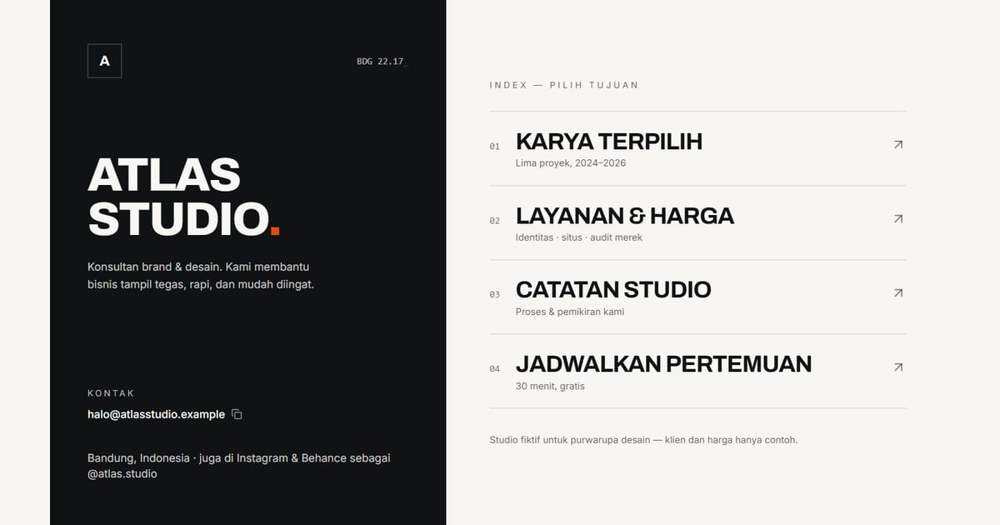

# Atlas Studio — Konsultan Brand & Desain, Bandung

Tautan Atlas Studio, konsultan brand dan desain di Bandung: indeks lima karya, catatan studio, layanan dengan harga tetap, dan jadwal pertemuan 30 menit.

**Demo live:** https://linkinbio-atlas.vercel.app



> Template link-in-bio dengan persona fiktif. Akun, klien, harga, dan jadwal hanya contoh; tautan utama menuju halaman dalam yang benar-benar ada, dan formulir tidak mengirim data.

## Konsep

Persona Atlas Studio, konsultan brand. Layar terbelah gaya Swiss: panel tinta dengan jam Jakarta dan tombol salin email, plus indeks tautan 01–05 yang berbalik warna saat disorot.

## Halaman

- `/` — panel tinta (jam Bandung, salin surel) + indeks tautan 01–04 yang membalik warna saat disorot
- `/karya` — indeks lima karya (tabel) dan catatan studio
- `/layanan` — tiga paket berharga tetap, proses, pemilih slot pertemuan

## Teknologi

- Next.js 15.5 (App Router) dan React 19
- Tailwind CSS v4
- JavaScript
- Lucide (ikon)
- Font: Archivo, Inter (next/font)
- SEO: metadata per halaman, Open Graph, JSON-LD, sitemap.xml, dan robots.txt

## Menjalankan secara lokal

```bash
npm install
npm run dev
```

Buka http://localhost:3000. Untuk build produksi: `npm run build` lalu `npm start`.

---

Bagian dari koleksi 12 template link-in-bio di [PortalBio](https://www.pintuweb.com/link-in-bio). Dibuat oleh [PintuWeb](https://www.pintuweb.com), jasa pembuatan website.
